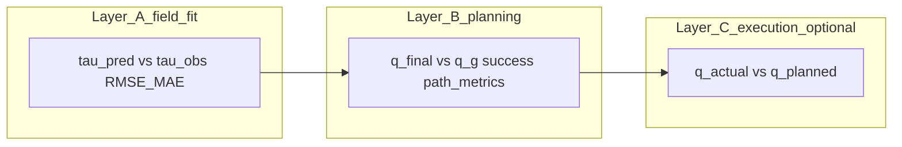

# Trajectory NTField evaluation

Evaluate checkpoints produced by `train_arm_trajectory.py` on trajectory data (`points.npy`, `tau_obs.npy`).

## Usage

From the **PI-VLA** repository root (with conda env `ntrl-demo` or equivalent):

```bash
python trajectory_evaluation/eval_trajectory_ntfield.py \
  --checkpoint ntrl-demo/Experiments/UR5_trajectory/trajectory_MM_DD_HH_MM/Model_Epoch_00500_ValLoss_*.pt \
  --data_path ntrl-demo/datasets/arm/UR5_trajectory \
  --device cuda:0
```

Options:

- `--val_ratio` — fraction of data for held-out metrics (default `0.2`).
- `--max_plan_samples` — cap planner runs for speed (default `200`).
- `--skip_planner` — only report τ RMSE / MAE / relative error.
- `--step_size`, `--max_steps`, `--tol` — passed to `planning/gradient_planner_trajectory.plan`.
- `--goal_success_eps_rad` — success threshold in radians (default `tol * SCALE` with `SCALE = π/0.5`).

---

# Trajectory NTField only — accuracy evaluation (plan)

**Scope:** Models trained with [`ntrl-demo/train/train_arm_trajectory.py`](../ntrl-demo/train/train_arm_trajectory.py) (dataset: `points.npy` + `tau_obs.npy`). **Not in scope:** `train_arm.py` / `metric_arm`, [`ntrl-demo/tests/arm_plan_stat.py`](../ntrl-demo/tests/arm_plan_stat.py) MPPI pipeline, `run_arm.sh`, grasping stack.

If you instead trained with [`ntrl-demo/trajectory_collision/train_arm_trajectory.py`](../ntrl-demo/trajectory_collision/train_arm_trajectory.py), loading and losses differ slightly (`trajectory_collision.model_function_metric`), but the **same evaluation ideas** apply; optional collision/clearance metrics become relevant.

---

## What the model is

A **travel-time field** τ(q_start, q_goal) over 12D concatenated joints (6+6), with gradients used for planning. Training supervision pairs each sample with **τ_obs** from [`ntrl-demo/dataprocessing/prepare_trajectory_dataset.py`](../ntrl-demo/dataprocessing/prepare_trajectory_dataset.py) output.

At test time, **planning** is [`ntrl-demo/planning/gradient_planner_trajectory.plan`](../ntrl-demo/planning/gradient_planner_trajectory.py)(model, q_start, q_goal, …): integrate **q_start** along `model.function.Gradient(XP)` until within **tol** in **normalized** space (`SCALE = π/0.5`).

Evaluation stacks three optional layers: fit of τ to supervision, then whether gradient planning reaches **q_goal**, then (if you execute on hardware/sim) tracking.



**Data flow (conceptual):** `points.npy` rows `(q_start, q_goal)` and `tau_obs.npy` feed **Layer A**; the same pairs (or held-out test split) feed `plan()` for **Layer B**; **Layer C** only applies if you run the planned trajectory on a sim or robot.

---

## Layer A — Field accuracy (direct model fit)

**Data:** Rows of `points.npy` (first 12 = q_start ∥ q_goal in the same layout as training) and `tau_obs.npy`.

- Hold out a fraction of indices (or a separate directory of test `.npy`).
- Forward each 12D point through the trained network (same normalization as training in `train_arm_trajectory.py`).
- Report **RMSE**, **MAE**, and optionally **relative error** on τ vs τ_obs.

This measures “does τ match the RRT / sampling supervision?”—independent of whether gradient planning reaches q_g.

---

## Layer B — Planning accuracy (given q_g)

For each test pair (q_start, q_goal):

1. Run `plan(...)` with fixed hyperparameters (step_size, max_steps, tol).
2. **Success:** final configuration within ε of q_goal — use **radians** for reporting; note `plan()`’s `tol` is in **normalized** joint space.
3. **Goal error:** L2 and L∞ over 6 joints (rad and optionally deg).
4. **Efficiency:** iteration count at termination, path length ∑‖Δq‖ in joint space (or normalized space for comparability).

Optional: compare planned path length or shape to a **reference** trajectory if you store one; not required for a minimal eval script.

---

## Layer C — Execution (optional, only if you command a sim/robot)

If the arm physically moves along the planned path: **tracking error** q_actual vs q_planned and **task success** at the end. This is outside the NTField code path but can be a separate metric.

---

## Implementation sketch (trajectory-only)

- Reuse the same **model build + `Function` + checkpoint load** pattern as [`train_arm_trajectory.py`](../ntrl-demo/train/train_arm_trajectory.py) (lines loading `DatabaseTrajectory`, instantiating `model_network.NN` and `model_function.Function`, and saving/loading `.pt` — load the inverse of save).
- **Field eval:** batch forward on test tensors, compare to `tau_obs`.
- **Planner eval:** loop `(q_start, q_g)` from test rows or sampled goals, call `plan()`, aggregate statistics.

No need to integrate `arm_plan_stat.py` or MPPI for this scope.

---

## Primary recommendation

1. **Primary:** planning **success rate** + **median final ‖q − q_g‖₂** over N held-out (q_start, q_goal) pairs.
2. **Secondary:** **τ RMSE** on the same or a separate held-out τ dataset.
3. **Collision/clearance:** only if you trained with `trajectory_collision/` and care about obstacles.

---

## Checklist (from original plan todos)

- [ ] Mirror `train_arm_trajectory.py`: load `NN`, `Function`, restore `.pt` from `Experiments/.../trajectory_*`.
- [ ] Held-out τ: RMSE/MAE between `TravelTimes` and `tau_obs`.
- [ ] For `(q_start, q_g)`, run `gradient_planner_trajectory.plan`; log success, final L2/Linf vs q_g, steps, path length.
- [ ] Only if trained with `trajectory_collision/`: add clearance / collision metrics.
